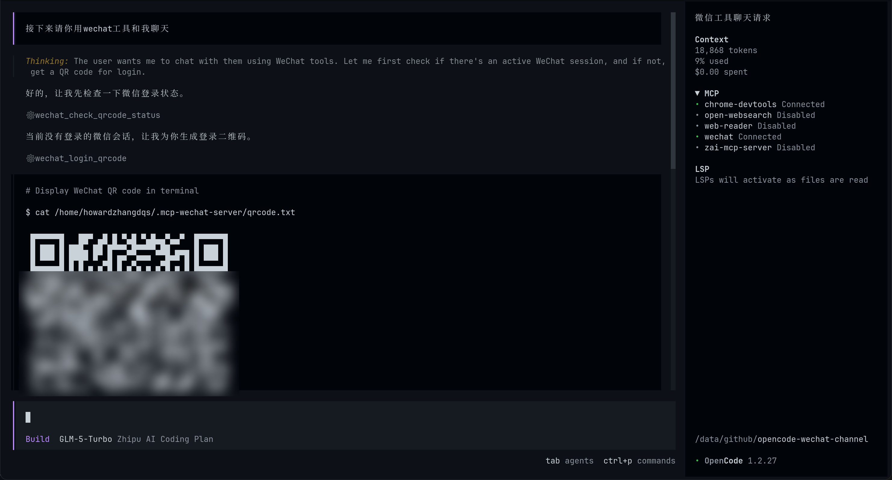
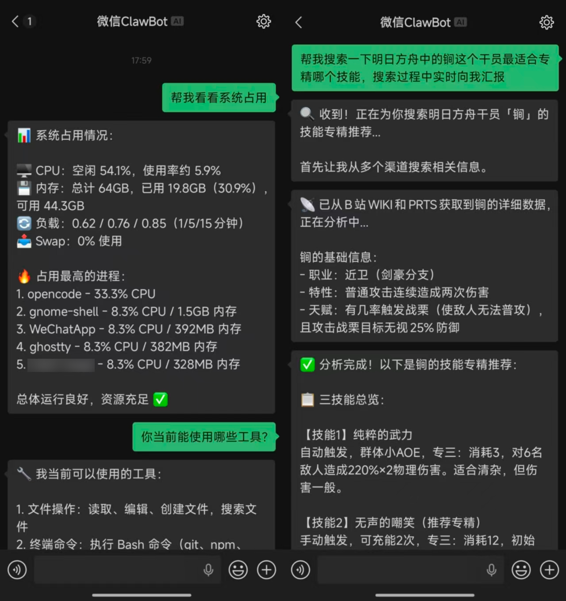
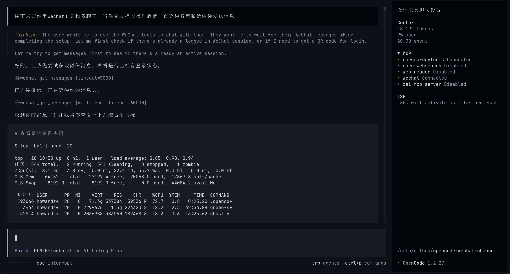
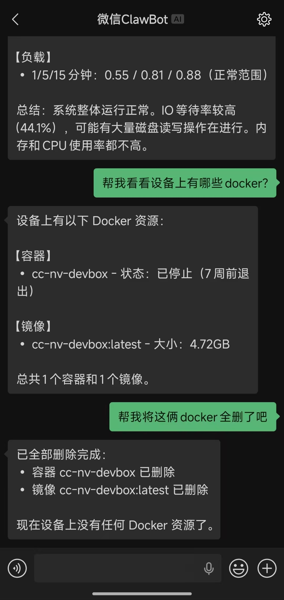

# mcp-wechat-server

基于 MCP（Model Context Protocol）的微信机器人服务器，让任何 AI Agent 都能收发微信消息。


## 功能

- **6 个 MCP 工具**：登录、消息轮询、文本发送、打字状态
- **扫码登录**：生成终端文本二维码、PNG 图片、URL 链接三种方式
- **长轮询监听**：阻塞等待新消息，最长可等待 7 天
- **打字状态**：Agent 处理消息时自动显示"对方正在输入..."
- **状态持久化**：重启不丢失登录凭证和消息游标
- **独立运行**：无需 OpenClaw 框架，开箱即用

## 快速开始

### Claude Desktop

在 `claude_desktop_config.json` 中添加：

```json
{
  "mcpServers": {
    "wechat": {
      "command": "bunx",
      "args": ["mcp-wechat-server"]
    }
  }
}
```

### OpenCode

在 `opencode.json` 中添加：

```json
{
  "mcp": {
    "wechat": {
      "type": "local",
      "command": ["bunx", "mcp-wechat-server"],
      "enabled": true
    }
  }
}
```

### Cursor / 其他 MCP 客户端

```json
{
  "command": "bunx",
  "args": ["mcp-wechat-server"]
}
```

> `bunx` 会自动从 npm 下载并运行，无需手动安装。

## 环境要求

- [Bun](https://bun.sh/) >= 1.0.0

## 使用方法

### 1. 扫码登录

AI Agent 调用 `login_qrcode` 生成二维码，你可以通过以下方式扫码：

- 在终端运行 `cat ~/.mcp-wechat-server/qrcode.txt` 查看二维码
- 打开图片文件 `~/.mcp-wechat-server/qrcode.png`
- 将链接复制到微信中打开

> **提示**：如果手机扫码后页面一直加载，请切换到**移动数据网络**（关闭 WiFi）。



### 2. 确认登录

Agent 调用 `check_qrcode_status` 确认登录状态。

### 3. 开始聊天

登录成功后，Agent 会自动执行以下流程：

1. 调用 `get_messages` 轮询新消息
2. 收到消息后调用 `send_typing` 显示"正在输入..."
3. 处理完成后调用 `send_text_message` 回复
4. 回复完毕后调用 `send_typing` 取消打字状态







## 工具列表

| 工具 | 说明 |
|------|------|
| `login_qrcode` | 生成微信登录二维码 |
| `check_qrcode_status` | 检查二维码是否已扫码确认 |
| `logout` | 退出登录并清除凭证 |
| `get_messages` | 拉取新消息（`wait=true` 阻塞等待直到收到消息） |
| `send_text_message` | 发送文本消息 |
| `send_typing` | 发送或取消"正在输入"状态 |

## 数据存储

所有数据保存在 `~/.mcp-wechat-server/` 目录下：

| 文件 | 说明 |
|------|------|
| `account.json` | Bot Token 和用户 ID（权限 600） |
| `state.json` | 消息游标和上下文 Token |
| `qrcode.png` | 生成的二维码图片 |
| `qrcode.txt` | 生成的终端二维码文本 |

## 本地开发

```bash
git clone https://github.com/Howardzhangdqs/mcp-wechat-server.git
cd mcp-wechat-server
bun install
bun run dev
```

## 许可证

MIT
